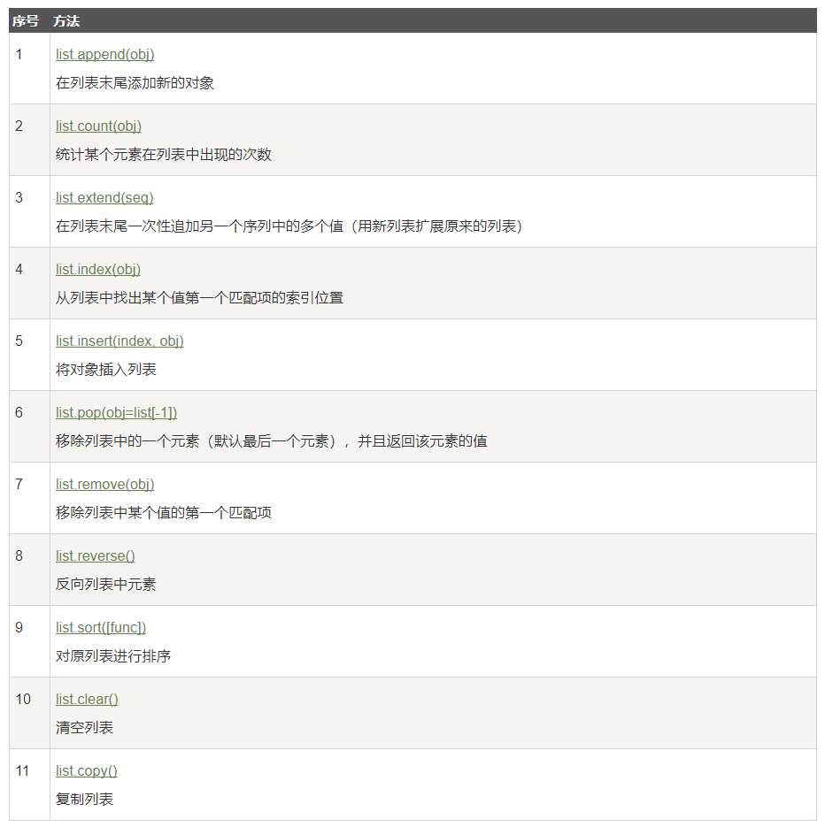
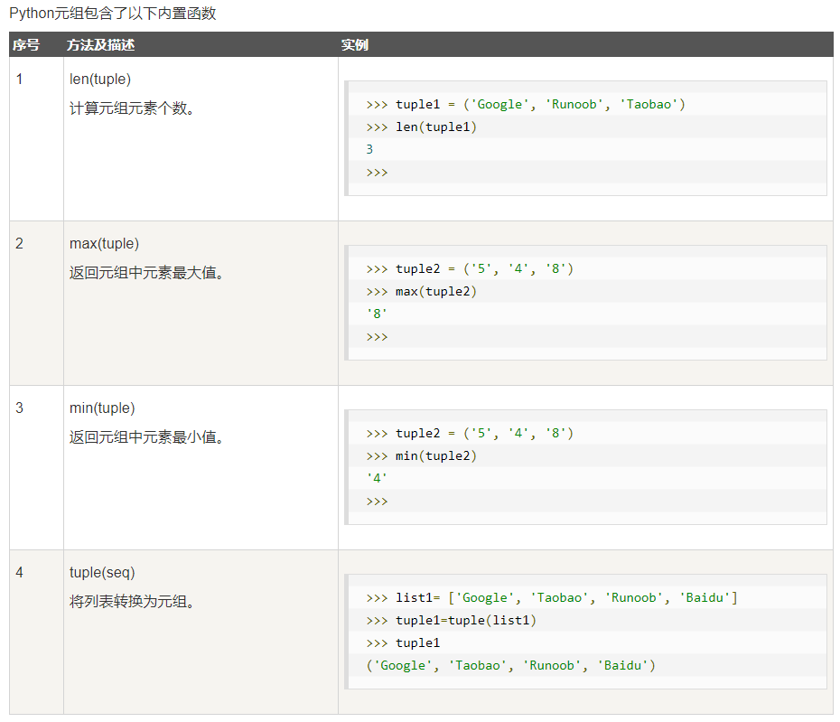
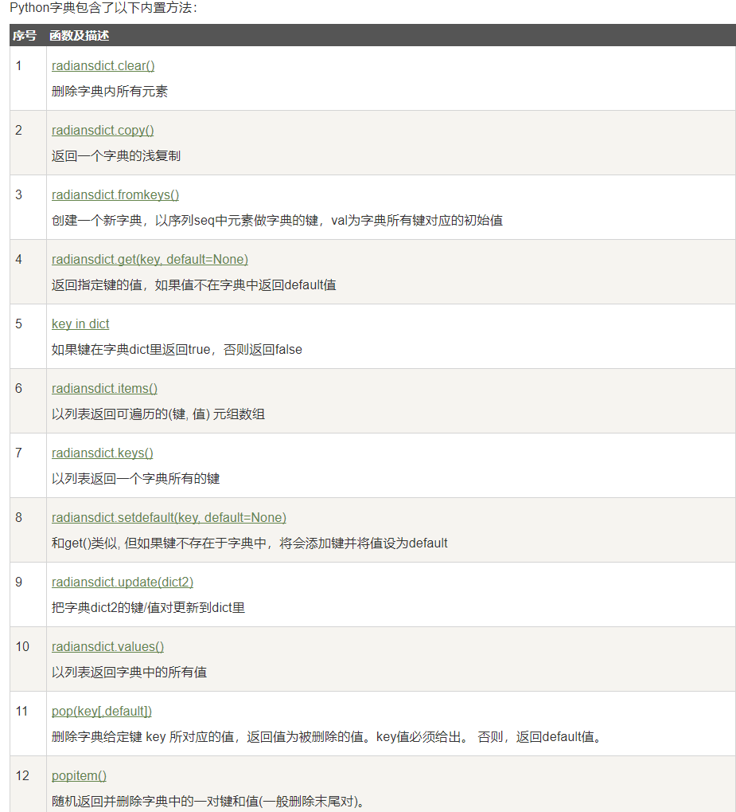
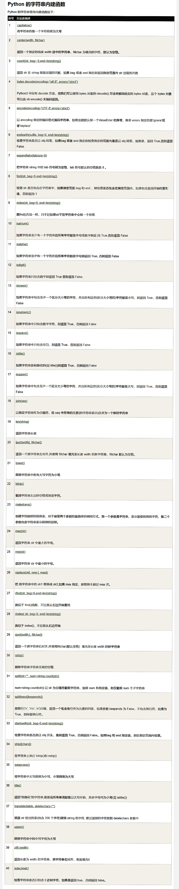

## py3基本语法和基本数据类型

### 1、关键字


```python
#注释1
#注释2
'''注释
多行,也可以输出多行字符串'''

#Python可以在同一行中使用多条语句，语句之间使用分号(;)分割
#关键字模块
import keyword
#keyword.kwlist
```


```python
#print   print 默认输出是换行的，如果要实现不换行需要在变量末尾加上 end=""
a=1
print (a)
```

    1
    

* print(*objects, sep=' ', end='\n', file=sys.stdout)
* objects -- 复数，表示可以一次输出多个对象。输出多个对象时，需要用 , 分隔。
* sep -- 用来间隔多个对象，默认值是一个空格。
* end -- 用来设定以什么结尾。默认值是换行符 \n，我们可以换成其他字符串。
* file -- 要写入的文件对象


```python
#slice()
myslice = slice(5)    # 设置截取5个元素的切片
arr = range(10)
arr[myslice]         # 截取 5 个元素
```


    range(0, 5)


### 2、反斜杠 三引号和空行


```python
seqString = 'Runoob'
print(list(reversed(seqString)))##不能用str 
```

    ['b', 'o', 'o', 'n', 'u', 'R']
    


```python
#多行语句，用反斜杠，多行字符串用三引号
#自然字符串， 通过在字符串前加r或R。 如 r"this is a line with \n" 则\n会显示，并不是换行。
#python允许处理unicode字符串，加前缀u或U， 如 u"this is an unicode string"。
#按字面意义级联字符串，如"this " "is " "string"会被自动转换为this is string
total1='a'+\
'b'+\
'c'
print(total1)
total2='''asfjkl
asd
faf
af
af'''
print(total2)
a='as''is''as'
a
```

    abc
    asfjkl
    asd
    faf
    af
    af
    


    'asisas'


```python
#空行，函数之间或类的方法之间用空行分隔，表示一段新的代码的开始。
#类和函数入口之间也用一行空行分隔，以突出函数入口的开始
#空行与代码缩进不同，空行并不是Python语法的一部分。书写时不插入空行，
#Python解释器运行也不会出错。但是空行的作用在于分隔两段不同功能或含义的代码，便于日后代码的维护或重构。
#空行也是程序的一部分
```


```python
#不换行输出
x="a"
y="b"
print( x, end=" " )
print( y, end=" " )
```

    a b 


```python
#import
#from somemodule import firstfunc, secondfunc, thirdfunc
#from somemodule import *
import sys
print('================Python import mode==========================');
print ('命令行参数为:')
for i in sys.argv:
    print (i)
print ('\n python 路径为',sys.path)
from sys import argv,path  #  导入特定的成员
 
print('================python from import===================================')
print('path:',path) # 因为已经导入path成员，所以此处引用时不需要加sys.path
```

    ================Python import mode==========================
    命令行参数为:
    D:\Anaconda3\lib\site-packages\ipykernel_launcher.py
    -f
    C:\Users\HANG LIU\AppData\Roaming\jupyter\runtime\kernel-df042aa2-8d41-4116-a846-d1cfaac7a617.json
    
     python 路径为 ['', 'D:\\Anaconda3\\python36.zip', 'D:\\Anaconda3\\DLLs', 'D:\\Anaconda3\\lib', 'D:\\Anaconda3', 'D:\\Anaconda3\\lib\\site-packages', 'D:\\Anaconda3\\lib\\site-packages\\Babel-2.5.0-py3.6.egg', 'D:\\Anaconda3\\lib\\site-packages\\win32', 'D:\\Anaconda3\\lib\\site-packages\\win32\\lib', 'D:\\Anaconda3\\lib\\site-packages\\Pythonwin', 'D:\\Anaconda3\\lib\\site-packages\\IPython\\extensions', 'C:\\Users\\HANG LIU\\.ipython']
    ================python from import===================================
    path: ['', 'D:\\Anaconda3\\python36.zip', 'D:\\Anaconda3\\DLLs', 'D:\\Anaconda3\\lib', 'D:\\Anaconda3', 'D:\\Anaconda3\\lib\\site-packages', 'D:\\Anaconda3\\lib\\site-packages\\Babel-2.5.0-py3.6.egg', 'D:\\Anaconda3\\lib\\site-packages\\win32', 'D:\\Anaconda3\\lib\\site-packages\\win32\\lib', 'D:\\Anaconda3\\lib\\site-packages\\Pythonwin', 'D:\\Anaconda3\\lib\\site-packages\\IPython\\extensions', 'C:\\Users\\HANG LIU\\.ipython']
    


```python
print(sys.argv)
len(sys.argv)#命令行参数个数
sys.argv[1]#脚本名字
```

    ['D:\\Anaconda3\\lib\\site-packages\\ipykernel_launcher.py', '-f', 'C:\\Users\\HANG LIU\\AppData\\Roaming\\jupyter\\runtime\\kernel-df042aa2-8d41-4116-a846-d1cfaac7a617.json']
    


    '-f'


### 3、多变量赋值 类型 删除变量 转义字符


```python
#多变量赋值 
#数字（int float bool complex）、字符串()、列表、元组、集合、字典
#/返回浮点数。//返回整数
a = b = c = 1 # 也可以a,b=1,2
d=complex(1,2)
print (a,b,c,d)
a, b, c = 1, 2, "runoob"
print (a,b,c)
#判断类型 type() or isinstance()
print(isinstance(a,int))
#type 和 instance 的区别:
#type()不会认为子类是一种父类类型。isinstance()会认为子类是一种父类类型
class A:
    pass

class B(A):
    pass

print(isinstance(A(), A))  # returns True
print(type(A()) == A)      # returns True
print(isinstance(B(), A))    # returns True
print(type(B()) == A)        # returns False
type(A())
```

    1 1 1 (1+2j)
    1 2 runoob
    True
    True
    True
    True
    False
    


    __main__.A


```python
#del
a=1
print (a)
del a#del a,b,c 
a
```

    1
    


    ---------------------------------------------------------------------------

    NameError                                 Traceback (most recent call last)

    <ipython-input-12-81839b80b0be> in <module>()
          3 print (a)
          4 del a#del a,b,c
    ----> 5 a
    

    NameError: name 'a' is not defined


```python
#转义字符的使用 r；与 C 字符串不同的是，Python 字符串不能被改变，
#字符串有两种索引方式，从左往右以0开始，从右往左以-1开始
print('Ru\noob')
print(r'Ru\noob')
```

    Ru
    oob
    Ru\noob
    

### 4、列表 元组 集合 字典

* 列表内置函数



```python
#List
list = [ 'abcd', 786 , 2.23, 'runoob', 70.2 ]
tinylist = [123, 'runoob']
 
print (list)            # 输出完整列表
print (list[0])         # 输出列表第一个元素
print (list[1:3])       # 从第二个开始输出到第三个元素
print (list[2:])        # 输出从第三个元素开始的所有元素
print (tinylist * 2)    # 输出两次列表
print (list + tinylist) # 连接列表
list[2:4]=[]#删除
print(list)
```

    ['abcd', 786, 2.23, 'runoob', 70.2]
    abcd
    [786, 2.23]
    [2.23, 'runoob', 70.2]
    [123, 'runoob', 123, 'runoob']
    ['abcd', 786, 2.23, 'runoob', 70.2, 123, 'runoob']
    ['abcd', 786, 70.2]
    

* 元组内置函数



```python
#Tuple 元组的元素不能修改 
#虽然tuple的元素不可改变，但它可以包含可变的对象，比如list列表
tuple = ( 'abcd', 786 , 2.23, 'runoob', 70.2  )
tinytuple = (123, 'runoob')
 
print (tuple)             # 输出完整元组
print (tuple[0])          # 输出元组的第一个元素
print (tuple[1:3])        # 输出从第二个元素开始到第三个元素
print (tuple[2:])         # 输出从第三个元素开始的所有元素
print (tinytuple * 2)     # 输出两次元组
print (tuple + tinytuple) # 连接元组
tup1 = ()    # 空元组
tup2 = (20,) # 一个元素，需要在元素后添加逗号
```

    ('abcd', 786, 2.23, 'runoob', 70.2)
    abcd
    (786, 2.23)
    (2.23, 'runoob', 70.2)
    (123, 'runoob', 123, 'runoob')
    ('abcd', 786, 2.23, 'runoob', 70.2, 123, 'runoob')
    


```python
#Set 无序不重复元素的序列,基本功能是进行成员关系测试和删除重复元素。
#可以使用大括号 { } 或者 set() 函数创建集合
#注意：创建一个空集合必须用 set() 而不是 { }，因为 { } 是用来创建一个空字典。
student = {'Tom', 'Jim', 'Mary', 'Tom', 'Jack', 'Rose'}
 
print(student)   # 输出集合，重复的元素被自动去掉
 
# 成员测试
if('Rose' in student) :
    print('Rose 在集合中')
else :
    print('Rose 不在集合中')
 
 
# set可以进行集合运算
a = set('abracadabra')#可以看一下输出
b = set('alacazam')
 
print(a)
 
print(a - b)     # a和b的差集
 
print(a | b)     # a和b的并集
 
print(a & b)     # a和b的交集
 
print(a ^ b)     # a和b中不同时存在的元素
```

    {'Rose', 'Jack', 'Jim', 'Tom', 'Mary'}
    Rose 在集合中
    {'d', 'r', 'c', 'a', 'b'}
    {'d', 'b', 'r'}
    {'d', 'm', 'r', 'c', 'l', 'a', 'z', 'b'}
    {'c', 'a'}
    {'m', 'd', 'r', 'z', 'b', 'l'}
    

* 字典内置函数



```python
#Dictionary 列表是有序的对象结合，字典是无序的对象集合
#区别在于：字典当中的元素是通过键来存取的，而不是通过偏移存取。
#键(key)必须使用不可变类型


dict = {}
dict['one'] = "1 - 菜鸟教程"
dict[2]     = "2 - 菜鸟工具"
 
tinydict = {'name': 'runoob','code':1, 'site': 'www.runoob.com'}
 
print (dict['one'])       # 输出键为 'one' 的值
print (dict[2])           # 输出键为 2 的值
print (tinydict)          # 输出完整的字典
print (tinydict.keys())   # 输出所有键
print (tinydict.values()) # 输出所有值
print (tinydict.items())  #返回的是列表，数据类型是元组
del dict 
# dict()是python的一个函数，但我又将dict自定义为一个python字典，
#在之后想调用dict()函数是会报出“TypeError: 'dict' object is not callable”的错误
```

    1 - 菜鸟教程
    2 - 菜鸟工具
    {'name': 'runoob', 'code': 1, 'site': 'www.runoob.com'}
    dict_keys(['name', 'code', 'site'])
    dict_values(['runoob', 1, 'www.runoob.com'])
    dict_items([('name', 'runoob'), ('code', 1), ('site', 'www.runoob.com')])
    


```python
a=dict([('Runoob', 1), ('Google', 2), ('Taobao', 3)])#可迭代对象方式来构造字典
b={x: x**2 for x in (2, 4, 6)}
c=dict(Runoob=1, Google=2, Taobao=3)#构建字典
print(a, '\n',b,'\n',c)
a['Google']=5#改变字典
b['asd']='wer'#添加对象
print(a, '\n',b)
m=dict(zip(['one', 'two', 'three'], [1, 2, 3]))#映射函数方式来构造字典
m
```

    {'Runoob': 1, 'Google': 2, 'Taobao': 3} 
     {2: 4, 4: 16, 6: 36} 
     {'Runoob': 1, 'Google': 2, 'Taobao': 3}
    {'Runoob': 1, 'Google': 5, 'Taobao': 3} 
     {2: 4, 4: 16, 6: 36, 'asd': 'wer'}
    


    {'one': 1, 'three': 3, 'two': 2}


### 5、位运算符


```python
#位运输算符 & | ^ ~ << >>
#转换成二进制数后进行计算
print(60&13) #60=0011 1100;13=0000 1101
print(60|13)
print(60^13)
print(~60)
print(60<<2)
print(60>>2)
```

    12
    61
    49
    -61
    240
    15
    


```python
#round 四舍五入用法
print(round(56.545))
print(round(56.545,1))
print(round(56.545,2))

#pow 的两种用法
print(pow(3,4,4))#3^4%4
print (pow(3,4))
import math
print(math.pow(3,4))
```

    57
    56.5
    56.55
    1
    81
    81.0
    

### 6、随机函数 数学函数 format函数 匿名函数


```python
#随机函数
import random

print ("从 range(100) 返回一个随机数 : ",random.choice(range(100)))
print ("从列表中 [1, 2, 3, 5, 9]) 返回一个随机元素 : ", random.choice([1, 2, 3, 5, 9]))
print ("从字符串中 'Runoob' 返回一个随机字符 : ", random.choice('Runoob'))
# 从 1-100 中选取一个奇数
print ("randrange(1,100, 2) : ", random.randrange(1, 100, 2))

# 从 0-99 选取一个随机数
print ("randrange(100) : ", random.randrange(100))

# 第一个随机数
print ("random() : ", random.random())

# 第二个随机数
print ("random() : ", random.random())

##随机函数
list = [20, 16, 10, 5];
random.shuffle(list)   #随机排序列表
print ("随机排序列表 : ",  list)
 
random.shuffle(list)
print ("随机排序列表 : ",  list)

print ("uniform(5, 10) 的随机浮点数 : ",  random.uniform(5, 10))

print ("uniform(7, 14) 的随机浮点数 : ",  random.uniform(7, 14))
```

    从 range(100) 返回一个随机数 :  52
    从列表中 [1, 2, 3, 5, 9]) 返回一个随机元素 :  2
    从字符串中 'Runoob' 返回一个随机字符 :  n
    randrange(1,100, 2) :  77
    randrange(100) :  54
    random() :  0.5924026260318155
    random() :  0.16561487031310673
    随机排序列表 :  [10, 5, 16, 20]
    随机排序列表 :  [5, 20, 10, 16]
    uniform(5, 10) 的随机浮点数 :  7.730927447511994
    uniform(7, 14) 的随机浮点数 :  11.738355683264576
    


```python
import math
print (math.tan(math.pi/4))
print ("degrees(3) : ",  math.degrees(3))
print ("degrees(-3) : ",  math.degrees(-3))
print ("degrees(0) : ",  math.degrees(0))
print ("degrees(math.pi) : ",  math.degrees(math.pi))#弧度变角度
print ("degrees(math.pi/2) : ",  math.degrees(math.pi/2))
print ("radians(3) : ",  math.radians(3))#角度变弧度
print ("radians(-3) : ",  math.radians(-3))
print ("radians(0) : ",  math.radians(0))

#返回欧几里得范数
print ("hypot(3, 2) : ",  math.hypot(3, 2))
a=math.e; b=math.pi
print(a,b)
```

    0.9999999999999999
    degrees(3) :  171.88733853924697
    degrees(-3) :  -171.88733853924697
    degrees(0) :  0.0
    degrees(math.pi) :  180.0
    degrees(math.pi/2) :  90.0
    radians(3) :  0.05235987755982989
    radians(-3) :  -0.05235987755982989
    radians(0) :  0.0
    hypot(3, 2) :  3.605551275463989
    2.718281828459045 3.141592653589793
    


```python
#format1
a='{} {}'.format("hello", "world")    # 不设置指定位置，按默认顺序
b="{0} {1}".format("hello", "world")  # 设置指定位置
c="{1} {0} {1}".format("hello", "world")  # 设置指定位置
print (a,'\n',b,'\n',c)

print("网站名：{name}, 地址 {url}".format(name="菜鸟教程", url="www.runoob.com"))
 
# 通过字典设置参数
site = {"name": "菜鸟教程", "url": "www.runoob.com"}
print("网站名：{name}, 地址 {url}".format(**site))
 
# 通过列表索引设置参数
my_list = ['菜鸟教程', 'www.runoob.com']
print("网站名：{0[0]}, 地址 {0[1]}".format(my_list))  # "0" 是可选的
```

    hello world 
     hello world 
     world hello world
    网站名：菜鸟教程, 地址 www.runoob.com
    网站名：菜鸟教程, 地址 www.runoob.com
    网站名：菜鸟教程, 地址 www.runoob.com
    


```python
#format2
print("{:.2f}".format(3.1415926)) #保留小数点后两位
print("{:+.2f}".format(3.1415926)) #带符号保留小数点后两位
print("{:+.2f}".format(-1)) #带符号保留小数点后两位
print("{:.0f}".format(2.71828))#不带小数
print("{:0>2d}".format(5))#数字补零 (填充左边, 宽度为2)
print("{:x<4d}".format(5))#数字补x (填充右边, 宽度为4)
print("{:x<4d}".format(10))#数字补x (填充右边, 宽度为4)
print("{:,}".format(1222222222220)) #以逗号分隔的数字格式
print("{:.3%}".format(0.25))#百分比格式,3为小数位置
print("{:.3e}".format(10000000000000))#指数格式
print("{:10d}".format(13))#右对齐 (默认, 宽度为10)
print("{:<10d}".format(13))#左对齐 (宽度为10)
print("{:^10d}".format(13))#中间对齐 (宽度为10)

#{:b}'.format(11)  b、d、o、x 分别是二进制、十进制、八进制、十六进制。
```

    3.14
    +3.14
    -1.00
    3
    05
    5xxx
    10xx
    1,222,222,222,220
    25.000%
    1.000e+13
            13
    13        
        13    
    


```python
#匿名函数 python 使用 lambda 来创建匿名函数，lambda的主体是一个表达式
#虽然lambda函数看起来只能写一行，却不等同于C或C++的内联函数，
#后者的目的是调用小函数时不占用栈内存从而增加运行效率

# 可写函数说明
sum = lambda arg1, arg2: arg1 + arg2;
 
# 调用sum函数
print ("相加后的值为 : ", sum( 10, 20 ))
print ("相加后的值为 : ", sum( 20, 20 ))
```

    相加后的值为 :  30
    相加后的值为 :  40
    


```python
#while循环使用 else
count = 0
while count < 5:
    print (count, " 小于 5")
    count = count + 1
else:
    print (count, " 大于或等于 5")
```

    0  小于 5
    1  小于 5
    2  小于 5
    3  小于 5
    4  小于 5
    5  大于或等于 5
    

### 7、迭代器 生成器


```python
#迭代器有两个基本的方法：iter() 和 next()。
#字符串，列表或元组对象都可用于创建迭代器
list=[1,2,3,4]
it = iter(list)    # 创建迭代器对象
print (next(it))   # 输出迭代器的下一个元素
print (next(it))   # 输出迭代器的下一个元素
print (next(it))   # 输出迭代器的下一个元素for x in it:
```

    1
    2
    3
    


```python
list=[1,2,3,4]
it = iter(list)    # 创建迭代器对象
for x in it:    # for 遍历
    print (x, end=" ")
```

    1 2 3 4 


```python
import sys         # 引入 sys 模块
 
list=[1,2,3,4]
it = iter(list)    # 创建迭代器对象
 
while True:
    try:
        print (next(it))
    except StopIteration:
        sys.exit('stop')
```

    1
    2
    3
    4
    


    An exception has occurred, use %tb to see the full traceback.
    

    SystemExit: stop
    


    D:\Anaconda3\lib\site-packages\IPython\core\interactiveshell.py:2870: UserWarning: To exit: use 'exit', 'quit', or Ctrl-D.
      warn("To exit: use 'exit', 'quit', or Ctrl-D.", stacklevel=1)
    


```python
#使用了 yield 的函数被称为生成器（generator）
#跟普通函数不同的是，生成器是一个返回迭代器的函数，只能用于迭代操作，更简单点理解生成器就是一个迭代器。
import sys
 
def fibonacci(n): # 生成器函数 - 斐波那契
    a, b, counter = 0, 1, 0
    while True:
        if (counter > n): 
            return #不带表达式的return相当于返回 None
        yield a
        a, b = b, a + b
        counter += 1
f = fibonacci(10) # f 是一个迭代器，由生成器返回生成

while True:
    try:
        print (next(f), end=" ")
    except StopIteration:
        sys.exit()
```

    0 1 1 2 3 5 8 13 21 34 55 


    An exception has occurred, use %tb to see the full traceback.
    

    SystemExit
    


    D:\Anaconda3\lib\site-packages\IPython\core\interactiveshell.py:2870: UserWarning: To exit: use 'exit', 'quit', or Ctrl-D.
      warn("To exit: use 'exit', 'quit', or Ctrl-D.", stacklevel=1)
    

### 8、mutable 和 immutable 以及变量作用域 global nonlocal关键字
***
>在 python 中，*strings, tuples, 和 numbers* 是**不可更改**的对象，而 list,dict 等则是可以修改的对象。
>不定长参数 ，加了星号的变量名会存放所有未命名的变量参数。如果在函数调用时没有指定参数，它就是一个空元组。

>Python的作用域一共有4种,L （Local） 局部作用域,E （Enclosing） 闭包函数外的函数中,G （Global） 全局作用域,B （Built-in） 内建作用域.以 L –> E –> G –>B 的规则查找

>当内部作用域想修改外部作用域的变量时，就要用到global和nonlocal关键字了


```python
#基本语法，不要运行
#def functionname([formal_args,] *var_args_tuple ):
#   "函数_文档字符串"
#   function_suite
#   return [expression]

# 可写函数说明
def printinfo( arg1, *vartuple ):
    '打印任何传入的参数'
    print ("输出: ")
    print (arg1)
    for var in vartuple:
        print (var)
    return;
 
# 调用printinfo 函数
printinfo( 10 );
printinfo( 70, 60, 50 );
```

    输出: 
    10
    输出: 
    70
    60
    50
    


```python
x = int(2.9)  # 内建作用域
 
g_count = 0  # 全局作用域
def outer():
    o_count = 1  # 闭包函数外的函数中
    def inner():
        i_count = 2  # 局部作用域
```


```python
#修改全局变量
num = 1
def fun1():
    global num  # 需要使用 global 关键字声明
    print(num) 
    num = 123
    print(num)
fun1()
num
```

    1
    123
    


    123


* 如果要修改嵌套作用域（enclosing 作用域，外层非全局作用域）中的变量则需要 nonlocal 关键字了，如下实例


```python
def outer():
    num = 10
    def inner():
        nonlocal num   # nonlocal关键字声明
        num = 100
        print(num)
    inner()
    print(num)
outer()
```

    100
    100
    

* 字符串内置函数

