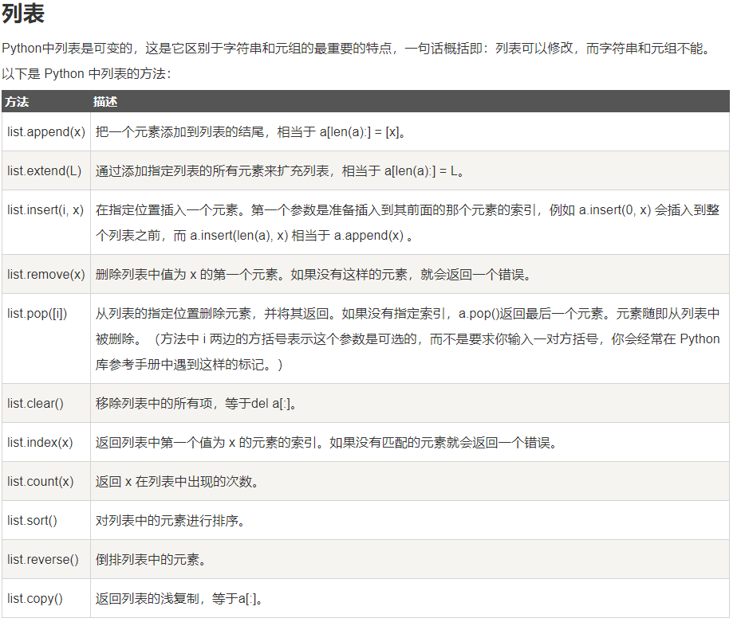
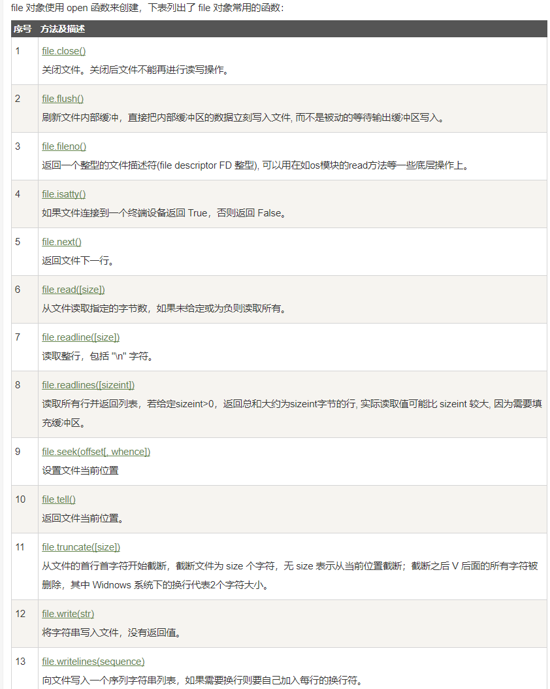

## py3 的数据结构 模块和输入输出

## 1、数据结构


***

* 列表的使用方法 示例如下



```python
a = [66.25, 333, 333, 1, 1234.5]
print(a.count(333), a.count(66.25), a.count('x'))
a.insert(2, -1)
a.append(333)
print(a)
print (a.index(333))
a.remove(333)
print(a)       
a.reverse()
print(a)
a.sort()
print(a)

print (a.pop()) #pop 函数可以将列表当做堆栈使用，后进先出
print(a)
print (a.pop());print (a.pop());print (a.pop());print (a.pop());print (a.pop())
```

    2 1 0
    [66.25, 333, -1, 333, 1, 1234.5, 333]
    1
    [66.25, -1, 333, 1, 1234.5, 333]
    [333, 1234.5, 1, 333, -1, 66.25]
    [-1, 1, 66.25, 333, 333, 1234.5]
    1234.5
    [-1, 1, 66.25, 333, 333]
    333
    333
    66.25
    1
    -1
    

* 将列表当做堆栈 队列 如上


```python
#类似队列1
from collections import deque
queue = deque(["Eric", "John", "Michael"])
queue.append("Terry")           # Terry arrives
queue.append("Graham")          # Graham arrives
print(queue.popleft())                 # The first to arrive now leaves
#类似队列2
print(queue.popleft())                 # The second to arrive now leaves
queue
```

    Eric
    John
    


    deque(['Michael', 'Terry', 'Graham'])


* 列表推导式创建列表


```python
vec = [2, 4, 6]
a=[[x, x**2] for x in vec]
c=[3*x for x in vec if x > 3]
d=[3*x for x in vec if x < 2]

vec2 = [4, 3, -9]
e=[x*y for x in vec for y in vec2]

f=[str(round(355/113, i)) for i in range(1, 6)]

freshfruit = ['  banana', '  loganberry ', 'passion fruit  ']
b=[weapon.strip() for weapon in freshfruit]
#[]不能少，strip 是去掉字符串末尾和开头的空格


print(a,'\n',b,'\n',c,'\n',d,'\n',e,'\n',f)
```

    [[2, 4], [4, 16], [6, 36]] 
     ['banana', 'loganberry', 'passion fruit'] 
     [12, 18] 
     [] 
     [8, 6, -18, 16, 12, -36, 24, 18, -54] 
     ['3.1', '3.14', '3.142', '3.1416', '3.14159']
    

* del 语句在list中的应用


```python
a = [-1, 1, 66.25, 333, 333, 1234.5]
del a[0];print(a);del a[2:4];print(a);del a[:];print(a)
```

    [1, 66.25, 333, 333, 1234.5]
    [1, 66.25, 1234.5]
    []
    

* 字典构建 遍历


```python
tel = {'jack': 4098, 'sape': 4139}
tel['guido'] = 4127#插入对象
del tel['sape']#删除对象
a=list(tel.keys())#返回字典建的列表
b=sorted(tel.keys())#键值排序

c= dict([('sape', 4139), ('guido', 4127), ('jack', 4098)])#list 构建
d={x: x**2 for x in (2, 4, 6)}#推导构建
e=dict(sape=4139, guido=4127, jack=4098)

print(a,'\n',b,'\n',c,'\n',d,'\n',e)
```

    ['jack', 'guido'] 
     ['guido', 'jack'] 
     {'sape': 4139, 'guido': 4127, 'jack': 4098} 
     {2: 4, 4: 16, 6: 36} 
     {'sape': 4139, 'guido': 4127, 'jack': 4098}
    


```python
#items() 遍历序列
knights = {'gallahad': 'the pure', 'robin': 'the brave'}
for k, v in knights.items():
    print(k,v)
```

    gallahad the pure
    robin the brave
    


```python
#enumerate() 函数自动生成键值，遍历序列
for i, v in enumerate(['tic', 'tac', 'toe']):
    print(i, v)
```

    0 tic
    1 tac
    2 toe
    


```python
#shunxuyunxing
dict_val = {'Name': 'Zara', 'Age': 7, 'Class': 'First'}
print(dict_val.keys())
print(type(dict_val.keys()))
```

    dict_keys(['Name', 'Age', 'Class'])
    <class 'dict_keys'>
    


```python
for key in dict_val.keys():
    print('{}--{}'.format(key, type(key)))
```

    Name--<class 'str'>
    Age--<class 'str'>
    Class--<class 'str'>
    


```python
print(dict_val.values())
print(type(dict_val.values()))
```

    dict_values(['Zara', 7, 'First'])
    <class 'dict_values'>
    


```python
for value in dict_val.values():
    print('{}--{}'.format(value, type(value)))
```

    Zara--<class 'str'>
    7--<class 'int'>
    First--<class 'str'>
    


```python
print(dict_val.items())
print(type(dict_val.items()))
```

    dict_items([('Name', 'Zara'), ('Age', 7), ('Class', 'First')])
    <class 'dict_items'>
    


```python
for item in dict_val.items():
    print('{}--{}'.format(item, type(item)))
```

    ('Name', 'Zara')--<class 'tuple'>
    ('Age', 7)--<class 'tuple'>
    ('Class', 'First')--<class 'tuple'>
    


```python
questions = ['name', 'quest', 'favorite color']
answers = ['lancelot', 'the holy grail', 'blue']
a=zip(questions, answers) #zip的用法？
for q, a in a:
    print('What is your {0}?  It is {1}.'.format(q, a))#格式化输出
    
```

    What is your name?  It is lancelot.
    What is your quest?  It is the holy grail.
    What is your favorite color?  It is blue.
    


```python
#reversed 和 sorted是可以直接用的函数，sort 和 reverse是要用list进行调用的函数
for i in reversed(range(1, 10, 2)):
    print (i)
    
basket = ['apple', 'orange', 'apple', 'pear', 'orange', 'banana']
for f in sorted(set(basket)):
    print(f)
```

    9
    7
    5
    3
    1
    apple
    banana
    orange
    pear
    

## 2、模块

***
想使用 Python 源文件，只需在另一个源文件里执行 import 语句;
如果你打算经常使用一个函数，你可以把它赋给一个本地的名称,比如 import numpy as np; m=np.math

假设定义了fibo.py
* from fibo import fib, fib2  #导入部分对象
* import fibo #导入全部对象
* from fibo import *  #导入全部对象，但是那些由单一下划线（_）开头的名字不在此例

一个模块被另一个程序第一次引入时，其主程序将运行。如果我们想在模块被引入时，模块中的某一程序块不执行，我们可以用\__name\__属性来使该程序块仅在该模块自身运行时执行。

说明： 每个模块都有一个\__name\__属性，当其值是'\__main\__'时，表明该模块自身在运行，否则是被引入。

* dir()函数 内置的函数 dir() 可以找到模块内定义的所有名称。以一个字符串列表的形式返回
        如果没有给定参数，那么 dir() 函数会罗列出当前定义的所有名称:


```python
import math
print (dir(math))
```

    ['__doc__', '__loader__', '__name__', '__package__', '__spec__', 'acos', 'acosh', 'asin', 'asinh', 'atan', 'atan2', 'atanh', 'ceil', 'copysign', 'cos', 'cosh', 'degrees', 'e', 'erf', 'erfc', 'exp', 'expm1', 'fabs', 'factorial', 'floor', 'fmod', 'frexp', 'fsum', 'gamma', 'gcd', 'hypot', 'inf', 'isclose', 'isfinite', 'isinf', 'isnan', 'ldexp', 'lgamma', 'log', 'log10', 'log1p', 'log2', 'modf', 'nan', 'pi', 'pow', 'radians', 'sin', 'sinh', 'sqrt', 'tan', 'tanh', 'tau', 'trunc']
    

* 标准模块

* 包
比如一个模块的名称是 A.B， 那么他表示一个包 A中的子模块 B 
目录只有包含一个叫做 __init__.py 的文件才会被认作是一个包，主要是为了避免一些滥俗的名字（比如叫做 string）不小心的影响搜索路径中的有效模块

注意当使用from package import item这种形式的时候，对应的item既可以是包里面的子模块（子包），或者包里面定义的其他名称，比如函数，类或者变量

如果使用形如import item.subitem.subsubitem这种导入形式，除了最后一项，都必须是包，而最后一项则可以是模块或者是包，但是不可以是类，函数或者变量的名字。

## 3、输入输出


* 输出格式美化

Python两种输出值的方式: 表达式语句和 print() 函数，第三种方式是使用文件对象的 write() 方法，标准输出文件可以用 sys.stdout 引用，如果你希望输出的形式更加多样，可以使用 str.format() 函数来格式化输出值，如果你希望将输出的值转成字符串，可以使用 repr() 或 str() 函数来实现。str()： 函数返回一个用户易读的表达形式。repr()： 产生一个解释器易读的表达形式。


```python
s = 'Hello, Runoob'
print (str(s))
s
print(s)
str(1/7)
repr(s) #注意引号

#  repr() 函数可以转义字符串中的特殊字符
hello = 'hello, runoob\n'
hellos=repr(hello)
print(hello)
print(hellos)

# repr() 的参数可以是 Python 的任何对象
repr((1.00, 20, ('Google', 'Runoob')))
```

    Hello, Runoob
    Hello, Runoob
    hello, runoob
    
    'hello, runoob\n'
    


    "(1.0, 20, ('Google', 'Runoob'))"


```python
for x in range(1, 11):
    print(repr(x).rjust(2), repr(x*x).rjust(3), end=' ')
    #rjust(width[,fillchar]) ljust(),center()
    # 注意前一行 'end' 的使用
    print(repr(x*x*x).rjust(4))
```

     1   1    1
     2   4    8
     3   9   27
     4  16   64
     5  25  125
     6  36  216
     7  49  343
     8  64  512
     9  81  729
    10 100 1000
    


```python
for x in range(1, 11):
    print('{0:2d} {1:3d} {2:4d}'.format(x, x*x, x*x*x))#格式化输出
```

     1   1    1
     2   4    8
     3   9   27
     4  16   64
     5  25  125
     6  36  216
     7  49  343
     8  64  512
     9  81  729
    10 100 1000
    


```python
#zfill()
'12'.zfill(5)#zfill() 在数字左边填0 至规定位数
```


    '00012'


```python
'3.14159265359'.zfill(5)
```


    '3.14159265359'


```python
'-3.14'.zfill(7)
```


    '-003.14'


```python
print('站点列表 {0}, {1}, 和 {other}。'.format('Google', 'Runoob',
                                         other='Taobao'))#断开与否不影响
```

    站点列表 Google, Runoob, 和 Taobao。
    

'!a' (使用 ascii()), '!s' (使用 str()) 和 '!r' (使用 repr()) 可以用于在格式化某个值之前对其进行转化:


```python
#'!a' (使用 ascii()), '!s' (使用 str()) 和 '!r' (使用 repr()) 
#可以用于在格式化某个值之前对其进行转化:
import math
print('常量 PI 的值近似为： {}。'.format(math.pi))
print('常量 PI 的值近似为： {!r}。'.format(math.pi))

print('常量 PI 的值近似为 {0:.3f}。'.format(math.pi))#精度设置
```

    常量 PI 的值近似为： 3.141592653589793。
    常量 PI 的值近似为： 3.141592653589793。
    常量 PI 的值近似为 3.142。
    

在 ':' 后传入一个整数, 可以保证该域至少有这么多的宽度。 用于美化表格时很有用


```python
table = {'Google': 1, 'Runoob': 2, 'Taobao': 3}
for name, number in table.items():
    print('{0:10} ==> {1:10d}'.format(name, number))#d 表示是整数，也可以不加，不影响输出
```

    Google     ==>          1
    Runoob     ==>          2
    Taobao     ==>          3
    

如果你有一个很长的格式化字符串, 而你不想将它们分开, 那么在格式化时通过变量名而非位置会是很好的事情。
最简单的就是传入一个字典, 然后使用方括号 '[]' 来访问键值 :


```python
table = {'Google': 1, 'Runoob': 2, 'Taobao': 3}
#注意下面的0 是索引值，format中只有一个对象，所以只能是0
print('Runoob: {0[Runoob]:d}; Google: {0[Google]:d}; Taobao: {0[Taobao]:d}'.format(table))
```

    Runoob: 2; Google: 1; Taobao: 3
    

**也可以通过在 table 变量前使用 '\*\*' 来实现相同的功能：**


```python
table = {'Google': 1, 'Runoob': 2, 'Taobao': 3}
print('Runoob: {Runoob:d}; Google: {Google:d}; Taobao: {Taobao:d}'.format(**table))
```

    Runoob: 2; Google: 1; Taobao: 3
    


```python
#旧式字符串格式化 %
import math
print('常量 PI 的值近似为：%10.2f。' % math.pi)
```

    常量 PI 的值近似为：      3.14。
    

* 读取键盘的输入


```python
#input 可以接受字符串
#input 可以接收一个Python表达式作为输入，并将运算结果返回。
str = input("请输入：");
print ("你输入的内容是: ", str)
```

    请输入：
    你输入的内容是:  
    

* pickle 模块 python的pickle模块实现了基本的数据序列和反序列化
* 通过pickle模块的序列化操作我们能够将程序中运行的对象信息保存到文件中去，永久存储
* 通过pickle模块的反序列化操作，我们能够从文件中创建上一次程序保存的对象。


```python
#pickle.dump(obj, file, [,protocol]) file: 类文件对象，有read()和readline()接口。
import pickle

# 使用pickle模块将数据对象保存到文件
data1 = {'a': [1, 2.0, 3, 4+6j],
         'b': ('string', u'Unicode string'),
         'c': None}

selfref_list = [1, 2, 3]
selfref_list.append(selfref_list)

output = open('data.pkl', 'wb')

# Pickle dictionary using protocol 0.
pickle.dump(data1, output)

# Pickle the list using the highest protocol available.
pickle.dump(selfref_list, output, -1)

output.close()
```


```python
import pprint, pickle

#使用pickle模块从文件中重构python对象
pkl_file = open('data.pkl', 'rb')

data1 = pickle.load(pkl_file)
pprint.pprint(data1) #单独一个print也是可以的

data2 = pickle.load(pkl_file)
pprint.pprint(data2)

pkl_file.close()
```

    {'a': [1, 2.0, 3, (4+6j)], 'b': ('string', 'Unicode string'), 'c': None}
    [1, 2, 3, <Recursion on list with id=1743718328328>]
    

## 4、文件

* 读写文件
* r+ 的指针好像在文本最后，图片中有误


* file 文件方法（相关操作函数）

1 2 3 4 无参数
* flush() 方法是用来刷新缓冲区的，即将缓冲区中的数据立刻写入文件，同时清空缓冲区，不需要是被动的等待输出缓冲区写入。一般情况下，文件关闭后会自动刷新缓冲区，但有时你需要在关闭前刷新它，这时就可以使用 flush() 方法。
* fileno() 方法返回一个整型的文件描述符(file descriptor FD 整型)，可用于底层操作系统的 I/O 操作。
* Python 3 中的 File 对象不支持 next() 方法
* read() 方法用于从文件读取指定的**字节数**，如果未给定或为负则读取所有。
* readline() 如果指定了一个非负数的参数，则返回指定大小的字节数，包括 "\n" 字符
* readlines() 方法用于读取所有行(直到结束符 EOF)并返回**列表**，该列表可以由 Python 的 for... in ... 结构进行处理。 如果碰到结束符 EOF 则返回空字符串。一般不设置参数
* truncate([size]) 方法用于从文件的首行首字符开始截断，截断文件为 size 个字符，无 size 表示从当前位置截断；截断之后 V 后面的所有字符被删除，其中 Widnows 系统下的换行代表2个字符大小。
* writelines([str]) 方法用于向文件中写入一序列的字符串。**该方法没有返回值。**





```python
#open(filename, mode)
#filename 变量是一个包含了你要访问的文件名称的字符串值，mode决定了打开文件的模式
# 打开一个文件，创建文件对象f
f = open("foo.txt", "w")#文件的路径问题回头要注意。默认为和运行的路径为同一路径

num=f.write( "Python3 是一个非常好的语言。\n是的，的确非常好!!\n" )
#f.write（string），将 string 写入到文件中, 然后返回写入的字符数
#如果不是string，要用str()进行转换
print (num)
f = open("foo.txt", "a")

f.write( "\n \t 追加写入\n测试成功!!\n" )
#返回文件对象当前所处的位置, 它是从文件开头开始算起的字节数。
print (f.tell())
#返回文件的当前位置
# 关闭打开的文件
f.close()
```

    30
    77
    

* 文件对象函数

>为了读取一个文件的内容，调用 f.read(size), 这将读取一定数目的数据, 然后作为**字符串或字节对象**返回，size 是一个可选的数字类型的参数。 当 size 被忽略了或者为负, 那么该文件的所有内容都将被读取并且返回。


```python
#上面已经创建f
f = open("foo.txt", "r")
str = f.read()
print(str)
# 关闭打开的文件
f.close()
```

    Python3 是一个非常好的语言。
    是的，的确非常好!!
    
     	 追加写入
    测试成功!!
    
    

>f.readline() 会从文件中读取单独的一行。换行符为 '\n'。f.readline() 如果返回一个空字符串, 说明已经已经读取到最后一行。


```python
#上面已经创建f
f = open("foo.txt", "r")
qq = f.readline(10)#括号内加入数字后，可以返回前几个字符，字符串中汉字也是一个字符
print(qq)
# 关闭打开的文件
f.close()
```

    Python3 是一
    

>如果要改变文件当前的位置, 可以使用 f.seek(offset, from_what) 函数。
>from_what 的值, 如果是 0(默认值) 表示开头, 如果是 1 表示当前位置, 2 表示文件的结尾
>seek(x,0) ： 从起始位置即文件首行首字符开始移动 x 个字符
>seek(x,1) ： 表示从当前位置往后移动x个字符
>seek(-x,2)：表示从文件的结尾往前移动x个字符


```python
d=open('fseek.txt','rb+')
d.write(b'0123456789abcdef') #前面的b代表二进制 字符串中不能有汉字！！！
d.seek(5)# 从文件开头移动5个字符
print (d.read(1))
d.seek(-3, 2) # 从结尾移动3个字节
print (d.read(1))

d.close()
#当你处理完一个文件后, 调用 f.close() 来关闭文件并释放系统的资源
```

    b'5'
    b'd'
    


```python
#fileno()
fo = open('fseek.txt', "rb+") 
print ("文件名为: ", fo.name)

fid = fo.fileno()
print ("文件描述符为: ", fid)

# 关闭文件
fo.close()
```

    文件名为:  fseek.txt
    文件描述符为:  4
    


```python
#isatty()
fo = open("runoob.txt", "wb")
print ("文件名为: ", fo.name)

ret = fo.isatty()
print ("返回值 : ", ret)

# 关闭文件
fo.close()
```

    文件名为:  runoob.txt
    返回值 :  False
    

## * 疑问


```python
#readline() ?????????????
#-*- coding: UTF-8 -*-

# 打开文件
fo = open("runoob.txt", "r+") #r+ 的指针好像在文本最后，图片中有误


line = fo.readline()
print ("读取第一行 %s" % (line))
line = fo.readline(2)
print ("读取的字符串为: %s " % (line)) 
fo.close()
```

    读取第一行 
    读取的字符串为:  
    


```python
#readlines()
fo = open("runoob.txt", "r")
print ("文件名为: ", fo.name)
 
for line in fo.readlines():                          #依次读取每行  
    line = line.strip()                             #去掉每行头尾空白  
    print ("读取的数据为: %s" % (line))
 
# 关闭文件
fo.close()
```

    文件名为:  runoob.txt
    


```python
#截取文件
fo = open("runoob.txt", "r+")
print ("文件名: ", fo.name)

line = fo.readline(5) #指针移位
print ("读取行: %s" % (line))

fo.truncate()
line = fo.readlines()
print ("读取行: %s" % (line))

# 关闭文件
fo.close()
```

    文件名:  runoob.txt
    读取行: 
    读取行: []
    


```python
##写入文件
fo = open("runoob.txt", "r+")
print ("文件名: ", fo.name)

str = "6:www.runoob.com"
# 在文件末尾写入一行
fo.seek(0, 2)
line = fo.write( str )

# 读取文件所有内容
fo.seek(0,0)
for index in range(6):
    line = next(fo)
    print ("文件行号 %d - %s" % (index, line))

# 关闭文件
fo.close()
```

    文件名:  runoob.txt
    文件行号 0 - 6:www.runoob.com
    


    ---------------------------------------------------------------------------

    StopIteration                             Traceback (most recent call last)

    <ipython-input-41-6cf1ecce8db7> in <module>()
         11 fo.seek(0,0)
         12 for index in range(6):
    ---> 13     line = next(fo)
         14     print ("文件行号 %d - %s" % (index, line))
         15 
    

    StopIteration: 


```python
# writelines() 方法的使用
# 打开文件
fo = open("test.txt", "a")
print ("文件名为: ", fo.name)
#seq = ["菜鸟教程 3\n", "菜鸟教程 4"]
seq='asdfghjkl我们时间'
fo.writelines( seq )

# 关闭文件
fo.close()
```

    文件名为:  test.txt
    
